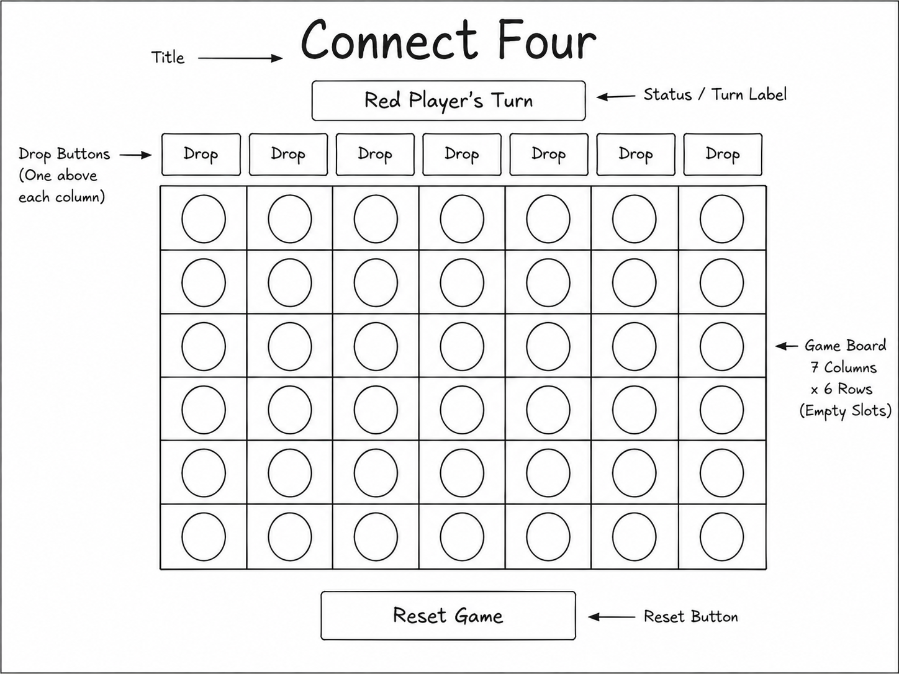

# Final Project GUI
My final project will be building a playable version of Connect Four.
Use [Markdown](https://www.markdownguide.org/basic-syntax) to format appropriately.
## Final Project Description
_My final project will be a two-player Connect Four game using JavaFX. The game will show a 7-column by 6-row board. Players will take turns choosing a column to drop their piece. The goal is to connect four pieces in a row horizontally, vertically, or diagonally. The GUI will include a game board, a label that shows whose turn it is, and a reset button to restart the game._

## GUI Wireframe
_The wireframe below shows the basic layout for my Connect Four game._

